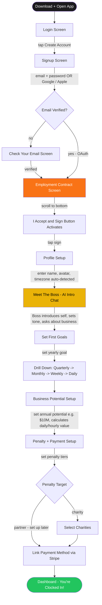
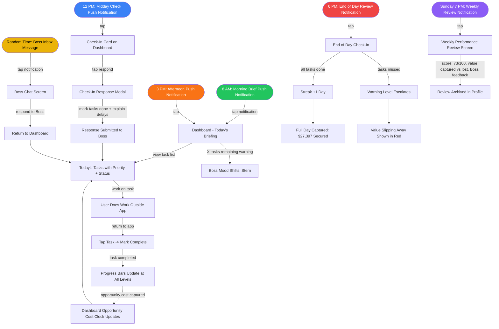
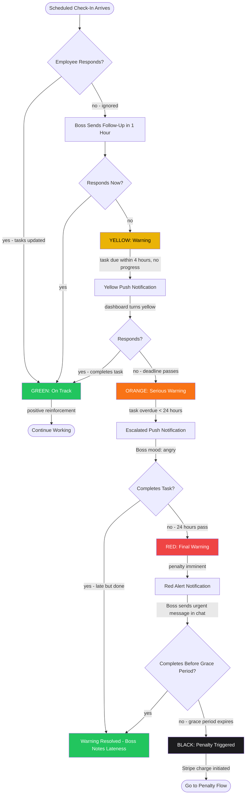
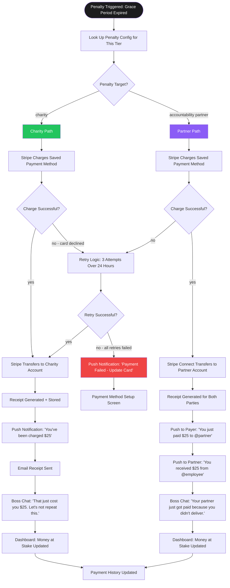
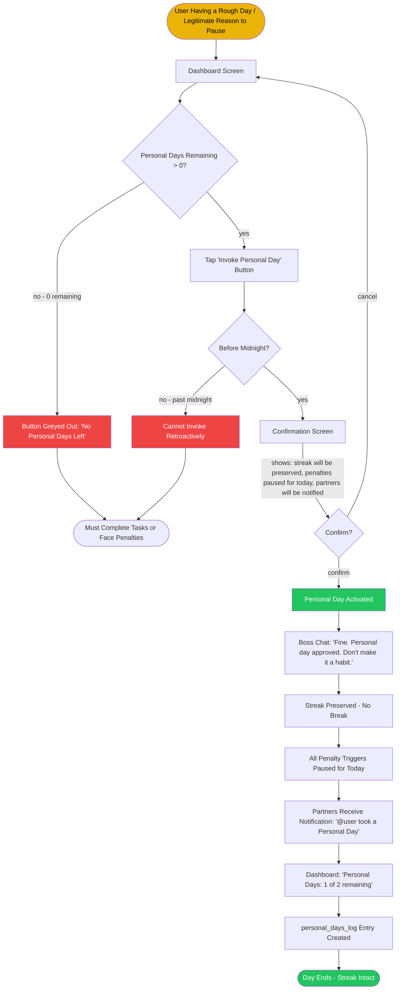

# Boss Mode — Wireframe Flow Diagrams

**Version:** 1.0
**Date:** 2026-03-30
**Companion to:** boss_mode_PDR.md

---

## Table of Contents

1. [Master App Map](#1-master-app-map)
2. [Flow 1: First-Time User (Onboarding)](#2-flow-1-first-time-user-onboarding)
3. [Flow 2: Daily Habit Loop](#3-flow-2-daily-habit-loop)
4. [Flow 3: Boss Check-In and Escalation](#4-flow-3-boss-check-in-and-escalation)
5. [Flow 4: Penalty Trigger](#5-flow-4-penalty-trigger)
6. [Flow 5: Personal Day](#6-flow-5-personal-day)
7. [Flow 6: Challenge (Partner Competition)](#7-flow-6-challenge-partner-competition)
8. [Screen Inventory Table](#8-screen-inventory-table)

---

## 1. Master App Map

Every screen in the app, grouped by area, with all navigation paths shown.

```mermaid
flowchart TB
    %% ──────────────────────────────────────────────
    %% ENTRY POINT
    %% ──────────────────────────────────────────────
    AppLaunch([App Launch])

    %% ──────────────────────────────────────────────
    %% AUTH GROUP
    %% ──────────────────────────────────────────────
    subgraph AUTH ["AUTH"]
        direction TB
        Login[Login]
        Signup[Signup]
        ForgotPW[Forgot Password]
    end

    AppLaunch -->|not authenticated| Login
    Login -->|new user| Signup
    Login -->|forgot| ForgotPW
    ForgotPW -->|reset sent| Login
    Signup -->|account created| Contract

    %% ──────────────────────────────────────────────
    %% ONBOARDING GROUP
    %% ──────────────────────────────────────────────
    subgraph ONBOARDING ["ONBOARDING"]
        direction TB
        Contract[Employment Contract]
        ProfileSetup[Profile Setup]
        MeetBoss[Meet The Boss - AI Chat Intro]
        FirstGoals[Set First Goals]
        SalarySetup[Business Potential Setup]
        PenaltySetup[Penalty + Payment Setup]
    end

    Contract -->|signed| ProfileSetup
    ProfileSetup --> MeetBoss
    MeetBoss --> FirstGoals
    FirstGoals --> SalarySetup
    SalarySetup --> PenaltySetup
    PenaltySetup -->|onboarding complete| Dashboard

    %% ──────────────────────────────────────────────
    %% RETURNING USER
    %% ──────────────────────────────────────────────
    AppLaunch -->|authenticated| Dashboard
    Login -->|existing user| Dashboard

    %% ──────────────────────────────────────────────
    %% TAB BAR
    %% ──────────────────────────────────────────────
    subgraph TABS ["MAIN TAB BAR"]
        direction LR
        Dashboard[Dashboard]
        ProjectsTab[Projects]
        PartnersTab[Partners + Challenges]
        ChatTab[Boss Chat]
        ProfileTab[Profile + Settings]
    end

    Dashboard <-->|tab| ProjectsTab
    Dashboard <-->|tab| PartnersTab
    Dashboard <-->|tab| ChatTab
    Dashboard <-->|tab| ProfileTab
    ProjectsTab <-->|tab| PartnersTab
    ProjectsTab <-->|tab| ChatTab
    ProjectsTab <-->|tab| ProfileTab
    PartnersTab <-->|tab| ChatTab
    PartnersTab <-->|tab| ProfileTab
    ChatTab <-->|tab| ProfileTab

    %% ──────────────────────────────────────────────
    %% DASHBOARD SCREENS
    %% ──────────────────────────────────────────────
    subgraph DASHBOARD_SCREENS ["DASHBOARD AREA"]
        direction TB
        TaskDetail_D[Task Detail]
        CheckInModal[Check-In Response Modal]
        PersonalDayConfirm[Personal Day Confirmation]
    end

    Dashboard -->|tap task| TaskDetail_D
    Dashboard -->|pending check-in| CheckInModal
    Dashboard -->|invoke personal day| PersonalDayConfirm
    PersonalDayConfirm -->|confirmed| Dashboard
    CheckInModal -->|submitted| Dashboard
    TaskDetail_D -->|back| Dashboard

    %% ──────────────────────────────────────────────
    %% PROJECTS + GOALS SCREENS
    %% ──────────────────────────────────────────────
    subgraph PROJECTS_SCREENS ["PROJECTS AREA"]
        direction TB
        ProjectDetail[Project Detail - Goals + Tasks]
        CreateProject[Create / Edit Project]
        GoalDetail[Goal Detail + Progress]
        CreateGoal[Create / Edit Goal]
        TaskDetail_G[Task Detail + Project Badge]
        CreateTask[Create / Edit Task]
    end

    ProjectsTab -->|tap project| ProjectDetail
    ProjectsTab -->|new project| CreateProject
    CreateProject -->|saved| ProjectsTab
    ProjectDetail -->|tap goal| GoalDetail
    ProjectDetail -->|new goal| CreateGoal
    ProjectDetail -->|tap task| TaskDetail_G
    ProjectDetail -->|new task| CreateTask
    GoalDetail -->|view task| TaskDetail_G
    GoalDetail -->|new task| CreateTask
    GoalDetail -->|edit| CreateGoal
    CreateGoal -->|saved| ProjectDetail
    CreateTask -->|saved| GoalDetail
    TaskDetail_G -->|back| GoalDetail

    %% ──────────────────────────────────────────────
    %% PARTNERS SCREENS
    %% ──────────────────────────────────────────────
    subgraph PARTNERS_SCREENS ["PARTNERS AREA"]
        direction TB
        PartnerProfile[Partner Profile + Stats]
        InvitePartner[Invite Partner]
        ChallengeDetail[Challenge Detail + Leaderboard]
        CreateChallenge[Create Challenge]
    end

    subgraph VIP_SCREENS ["VIP HIGH STAKES"]
        direction TB
        VIPDetail[VIP Challenge Detail — Milestones + Verifier]
        VIPCreate[Create VIP Challenge]
        VIPEvidence[Submit Evidence]
    end

    PartnersTab -->|tap partner| PartnerProfile
    PartnersTab -->|invite| InvitePartner
    PartnersTab -->|tap challenge| ChallengeDetail
    PartnersTab -->|new challenge| CreateChallenge
    PartnersTab -->|tap VIP challenge| VIPDetail
    PartnersTab -->|create VIP challenge| VIPCreate
    VIPDetail -->|submit evidence| VIPEvidence
    VIPEvidence -->|submitted| VIPDetail
    VIPCreate -->|sent| VIPDetail
    InvitePartner -->|sent| PartnersTab
    CreateChallenge -->|created| ChallengeDetail
    PartnerProfile -->|back| PartnersTab
    ChallengeDetail -->|back| PartnersTab
    PartnerProfile -->|challenge partner| CreateChallenge

    %% ──────────────────────────────────────────────
    %% BOSS CHAT SCREENS
    %% ──────────────────────────────────────────────
    subgraph CHAT_SCREENS ["BOSS CHAT AREA"]
        direction TB
        ChatScreen[AI Chat with Boss]
        ReviewDetail[Weekly Performance Review]
    end

    ChatTab --> ChatScreen
    ChatTab -->|tap review notification| ReviewDetail
    ReviewDetail -->|back| ChatTab

    %% ──────────────────────────────────────────────
    %% PROFILE SCREENS
    %% ──────────────────────────────────────────────
    subgraph PROFILE_SCREENS ["PROFILE + SETTINGS AREA"]
        direction TB
        ViewContract[View Signed Contract]
        PenaltySettings[Penalty + Stakes Settings]
        BossSettings[Boss Settings]
        PaymentSetup[Payment Method Setup]
        CharitySelect[Select Charities]
        PaymentHistory[Payment History]
        PerformanceHistory[Performance Review Archive]
        StatsPage[Lifetime Stats]
    end

    ProfileTab -->|my contract| ViewContract
    ProfileTab -->|penalties| PenaltySettings
    ProfileTab -->|boss settings| BossSettings
    ProfileTab -->|payment method| PaymentSetup
    ProfileTab -->|charities| CharitySelect
    ProfileTab -->|payment history| PaymentHistory
    ProfileTab -->|performance reviews| PerformanceHistory
    ProfileTab -->|lifetime stats| StatsPage
    PenaltySettings -->|amount changed > 50%| ViewContract
    PerformanceHistory -->|tap review| ReviewDetail

    ViewContract -->|back| ProfileTab
    PenaltySettings -->|back| ProfileTab
    BossSettings -->|back| ProfileTab
    PaymentSetup -->|back| ProfileTab
    CharitySelect -->|back| ProfileTab
    PaymentHistory -->|back| ProfileTab
    PerformanceHistory -->|back| ProfileTab
    StatsPage -->|back| ProfileTab

    %% ──────────────────────────────────────────────
    %% CROSS-AREA NAVIGATION
    %% ──────────────────────────────────────────────
    Dashboard -->|tap challenge card| ChallengeDetail
    Dashboard -->|tap boss mood| ChatScreen
    CheckInModal -->|open chat| ChatScreen

    %% ──────────────────────────────────────────────
    %% STYLES
    %% ──────────────────────────────────────────────
    style AUTH fill:#EF4444,color:#fff
    style ONBOARDING fill:#F97316,color:#fff
    style TABS fill:#1C1C1E,color:#fff
    style DASHBOARD_SCREENS fill:#22C55E,color:#fff
    style PROJECTS_SCREENS fill:#3B82F6,color:#fff
    style PARTNERS_SCREENS fill:#8B5CF6,color:#fff
    style VIP_SCREENS fill:#EAB308,color:#000
    style CHAT_SCREENS fill:#EAB308,color:#000
    style PROFILE_SCREENS fill:#6B7280,color:#fff
```

---

## 2. Flow 1: First-Time User (Onboarding)

The complete journey from download to first Dashboard view.

---

## 3. Flow 2: Daily Habit Loop

The core engagement loop that drives daily active usage.

---

## 4. Flow 3: Boss Check-In and Escalation

How warnings escalate when the employee falls behind.

---

## 5. Flow 4: Penalty Trigger

What happens when a penalty is triggered — from charge to receipt.

---

## 6. Flow 5: Personal Day

How an employee invokes a Personal Day to protect their streak.

---

## 7. Flow 6: Challenge (Partner Competition)

End-to-end flow of a competitive accountability challenge.

```mermaid
flowchart TD
    Start([Partner Wants to Compete])
    Start --> PartnersTab[Partners + Challenges Tab]
    PartnersTab --> CreateBtn[Tap 'Create Challenge']
    CreateBtn --> CreateScreen[Create Challenge Screen]

    CreateScreen --> SetDetails[Set: Title, Description]
    SetDetails --> SetDates[Set: Start Date + End Date]
    SetDates --> SetStake[Set: Stake Amount per Person e.g. $50]
    SetStake --> SetTarget{Penalty Target?}
    SetTarget -->|winner takes stake| WinnerMode[Winner Takes All]
    SetTarget -->|loser donates to charity| CharityMode[Loser Donates to Charity]
    WinnerMode --> InvitePartner
    CharityMode --> InvitePartner[Select Partner to Challenge]

    InvitePartner --> SendChallenge[Challenge Invite Sent]
    SendChallenge --> PartnerNotif[Partner Receives Push: '@user challenged you to a duel!']
    PartnerNotif --> PartnerDecision{Partner Accepts?}

    PartnerDecision -->|decline| Cancelled([Challenge Cancelled])
    PartnerDecision -->|accept| BothAccepted[Challenge Accepted]

    BothAccepted --> AssignTasks1[User A: Assigns Own Tasks to Challenge]
    BothAccepted --> AssignTasks2[User B: Assigns Own Tasks to Challenge]
    AssignTasks1 --> ChallengeActive
    AssignTasks2 --> ChallengeActive[Challenge Goes Active on Start Date]

    ChallengeActive --> LiveBoard[Live Leaderboard: Real-Time Completion %]
    LiveBoard --> DashCard[Mini Leaderboard Card on Both Dashboards]

    DashCard --> CompleteTasks[Both Users Complete Tasks Over Challenge Period]
    CompleteTasks -->|real-time updates| LiveBoard

    CompleteTasks --> EndDate{Challenge End Date Reached}
    EndDate --> CalcWinner[Calculate: Highest Completion %]
    CalcWinner --> TieCheck{Tie?}
    TieCheck -->|no| WinnerDetermined[Winner Determined]
    TieCheck -->|yes| TieBreak[Tiebreaker: Fewest Missed Deadlines]
    TieBreak --> WinnerDetermined

    WinnerDetermined --> ChargeLoser[Stripe Charges Loser's Stake]
    ChargeLoser --> PayoutTarget{Penalty Target?}
    PayoutTarget -->|winner| TransferWinner[Stripe Transfers Stake to Winner]
    PayoutTarget -->|charity| TransferCharity[Stripe Donates Stake to Charity]

    TransferWinner --> ResultScreen
    TransferCharity --> ResultScreen[Challenge Result Screen]
    ResultScreen -->|shows: winner, scores, payout| NotifyBoth[Push Notifications to Both]
    NotifyBoth --> UpdateStats[Win/Loss Records Updated]
    UpdateStats --> Leaderboard[Partner Leaderboard Updated]
    Leaderboard --> Done([Challenge Complete])

    style Start fill:#8B5CF6,color:#fff
    style ChallengeActive fill:#22C55E,color:#fff
    style WinnerDetermined fill:#EAB308,color:#000
    style Cancelled fill:#EF4444,color:#fff
    style Done fill:#22C55E,color:#fff
```

---

## 8. Screen Inventory Table

Every screen in the app with route, parent area, purpose, and build phase.

| # | Screen Name | Route | Area | Purpose | Phase |
|---|-------------|-------|------|---------|-------|
| 1 | Login | `(auth)/login` | Auth | Email/password + Google/Apple sign-in | 1 |
| 2 | Signup | `(auth)/signup` | Auth | Create new account | 1 |
| 3 | Forgot Password | `(auth)/forgot-password` | Auth | Password reset via email | 1 |
| 4 | Employment Contract | `onboarding/contract` | Onboarding | Formal contract user must sign to proceed | 1 |
| 5 | Profile Setup | `onboarding/profile-setup` | Onboarding | Name, avatar, timezone configuration | 1 |
| 6 | Meet The Boss | `onboarding/meet-the-boss` | Onboarding | AI intro chat that sets the Boss/Employee tone | 4 |
| 7 | Set First Goals | `onboarding/first-goals` | Onboarding | Create yearly goal and drill down to daily tasks | 2 |
| 8 | Business Potential Setup | `onboarding/potential-setup` | Onboarding | Set annual business potential for opportunity cost calculation | 2 |
| 9 | Penalty + Payment Setup | `onboarding/penalty-setup` | Onboarding | Configure penalty tiers, link Stripe, select charities | 5 |
| 10 | **Dashboard** | `(tabs)/index` | Tab: Dashboard | Today's tasks, check-in card, streak, money at stake, boss mood, opportunity cost clock, challenge card | 1 (shell), 2-3 (full) |
| 11 | **Projects** | `(tabs)/projects` | Tab: Projects | All projects (reorderable), All Tasks cross-project view, project badges | 2 |
| 12 | **Partners + Challenges** | `(tabs)/partners` | Tab: Partners | Partner list, active challenges, leaderboard | 6 |
| 13 | **Boss Chat** | `(tabs)/chat` | Tab: Chat | AI chat thread with The Boss, check-in history, Boss Inbox messages | 4 |
| 14 | **Profile + Settings** | `(tabs)/profile` | Tab: Profile | User info, links to all settings screens, lifetime stats | 1 (shell), 2+ (full) |
| 15 | Task Detail | `task/[id]` | Modal | Task details, status update, mark complete/failed | 2 |
| 16 | Goal Detail | `goal/[id]` | Modal | Goal details, child goals/tasks, progress bar | 2 |
| 17 | Create / Edit Goal | `goal/create` | Modal | Form: title, description, timeframe, dates, parent goal | 2 |
| 18 | Create / Edit Task | `task/create` | Modal | Form: title, description, due date/time, priority, recurrence | 2 |
| 19 | Check-In Response | `checkin/[id]` | Modal | Respond to Boss check-in: mark tasks, write excuse | 3 |
| 20 | Weekly Performance Review | `review/[id]` | Modal | Formal HR-style weekly review: score, summary, Boss feedback | 3 |
| 21 | Partner Profile | `partner/[id]` | Modal | Partner's completion rate, streak, challenge history, stats | 6 |
| 22 | Invite Partner | `partner/invite` | Modal | Send invite via code or email search | 6 |
| 23 | Challenge Detail | `challenge/[id]` | Modal | Live leaderboard, task progress, standings, payout info | 6 |
| 24 | Create Challenge | `challenge/create` | Modal | Form: title, dates, stake, penalty target, select partner | 6 |
| 25 | View Signed Contract | `profile/contract` | Profile Sub | Read-only view of signed employment contract | 1 |
| 26 | Penalty Settings | `profile/penalty` | Profile Sub | Configure penalty amounts per tier, choose charity vs partner | 5 |
| 27 | Boss Settings | `profile/boss` | Profile Sub | Check-in times, Boss Inbox frequency, Boss intensity | 3 |
| 28 | Payment Method Setup | `profile/payment` | Profile Sub | Add/update Stripe payment method | 5 |
| 29 | Select Charities | `profile/charity` | Profile Sub | Choose from curated charity list for penalty donations | 5 |
| 30 | Payment History | `profile/history` | Profile Sub | All penalty charges, receipts, partner transfers | 5 |
| 31 | Performance Review Archive | `profile/reviews` | Profile Sub | Browse all past weekly reviews by date | 3 |
| 32 | Lifetime Stats | `profile/stats` | Profile Sub | Value captured/lost, capture rate, challenge W/L, opportunity cost history | 2 (opp. cost), 6 (partner stats) |
| 33 | Personal Day Confirmation | Dashboard Modal | Dashboard | Confirm invoking a Personal Day: Boss quote, streak info | 2 |
| 34 | Project Detail | `project/[id]` | Modal | Goals + tasks within a single project, project stats | 2 |
| 35 | Create / Edit Project | `project/create` | Modal | Form: name, description, icon, colour label, status | 2 |
| 36 | VIP Challenge Detail | `vip/[id]` | VIP | Milestones, evidence status, verifier info, standings, rules | 6 |
| 37 | Create VIP Challenge | `vip/create` | VIP | Stake ($5K+), milestones, partner selection, verifier selection | 6 |
| 38 | Submit VIP Evidence | `vip/evidence/[id]` | VIP | Upload screenshots/URLs/videos, description for verifier | 6 |

---

### Screen Count by Phase

| Phase | New Screens | Cumulative |
|-------|-------------|------------|
| Phase 1: Foundation | 8 (Login, Signup, Forgot PW, Contract, Profile Setup, Dashboard shell, Profile shell, View Contract) | 8 |
| Phase 2: Goal + Task Engine | 11 (Projects tab, Project Detail, Create Project, Task Detail, Goal Detail, Create Goal, Create Task, Business Potential Setup, First Goals, Personal Day Confirm, Lifetime Stats partial) | 19 |
| Phase 3: Boss Check-In | 4 (Check-In Response, Weekly Review, Boss Settings, Performance Archive) | 23 |
| Phase 4: AI Boss Chat | 2 (Boss Chat tab, Meet The Boss onboarding) | 25 |
| Phase 5: Penalties | 5 (Penalty Setup onboarding, Penalty Settings, Payment Setup, Select Charities, Payment History) | 30 |
| Phase 6: Partners | 8 (Partners tab, Partner Profile, Invite Partner, Challenge Detail, Create Challenge, VIP Detail, VIP Create, VIP Evidence) | 38 |
| Phase 7: Polish | 0 new screens (widget is OS-level, not in-app) | 38 |

---

### Navigation Legend

| Arrow Style | Meaning |
|------------|---------|
| `-->` | Primary navigation (forward) |
| `<-->` | Tab bar switching (bidirectional) |
| `-->\|label\|` | Conditional navigation with trigger described |
| Subgraph colour | Groups screens by functional area |

---

*End of Wireframe Flow Diagrams v1.0*
